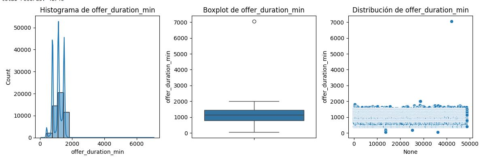
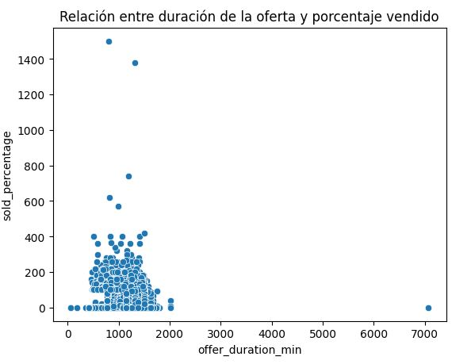
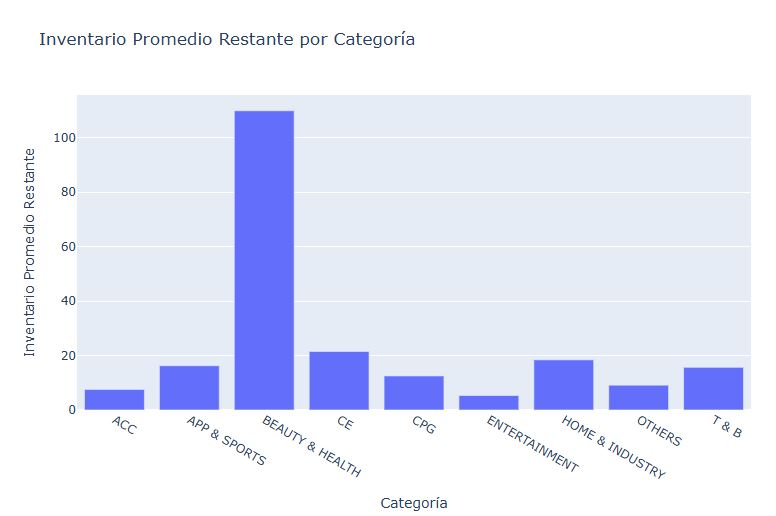
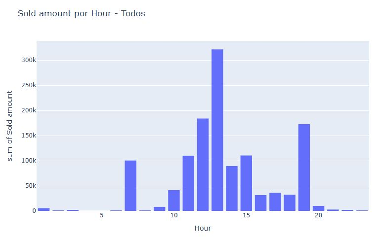
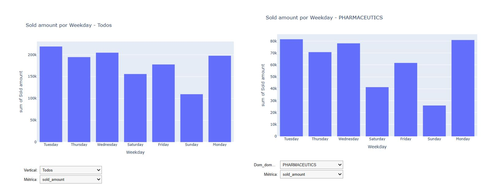

# **Análisis de Ofertas Relámpago - Data Science**

---

## **1. Resolución del Reto**
Este análisis tuvo como objetivo principal responder al reto planteado sobre las ofertas relámpago. Nos enfocamos en entender los patrones de comportamiento en las ventas, identificar tendencias clave y generar insights que puedan servir como base para decisiones estratégicas. 

Se realizó un análisis detallado de los datos, acompañado de visualizaciones dinámicas e interactivas que permitieron explorar diferentes aspectos del rendimiento de las ofertas.

---

## **2. Proceso de Análisis**

### **2.1 Comprensión de los Datos**

Los datos utilizados incluyen información detallada sobre:

El dataset utilizado ofertas_relampago.csv consiste de las siguientes 13 columnas: 
- OFFER_START_DATE: día en el que comenzo la oferta relámpago.
- OFFER_START_DTTM: datetime en el que comenzo la oferta relámpago.
- OFFER_FINISH_DTTM: datetime en el que finalizó la oferta relámpago.
- OFFER_TYPE: en este caso es _lightning_deal_.
- INVOLVED_STOCK: la cantidad de stock involucrado.
- REMAINING_STOCK_AFTER_END: el stock remanente al finalizar la oferta. 
- SOLD_AMOUNT: el monto vendido.
- SOLD_QUANTITY: la cantidad de producto vendido.
- ORIGIN: origen del producto.
- SHIPPING_PAYMENT_TYPE: tipo de pago del envio. 
- DOM_DOMAIN_AGG1: agrupación del tipo de producto al cual nos referiremos como _'categoría'_.
- VERTICAL: agrupación vertical del dominio o tipo de producto al cual nos referiremos como _'clase'_.
- DOMAIN_ID: nombre del tipo de producto. 

**Preparación de los Datos:**
1. **Limpieza de columnas irrelevantes o inconsistentes:**
   - **Columnas eliminadas:**
     - `offer_type`: Todos sus valores eran iguales.
     - `origin`: Presentaba un alto porcentaje de valores faltantes.
2. **Creación de métricas clave:**
   - **Porcentaje vendido:** Relación entre las unidades vendidas y el inventario disponible.
   - **Duración en minutos:** Tiempo total que duró cada oferta.
   - **Variables temporales:** Hora y día de la semana en que se inició cada campaña.
3. **Revisión base de la información:**
> _ _

##### OFFER_START_DATE
Las ofertas comenzaron entre el 1 de junio y el 31 de julio de 2021. Notamos una tendencia creciente en la cantidad de ofertas que inician durante las dos últimas semanas de julio, mientras que en junio ocurre lo contrario. En julio, la frecuencia máxima de ofertas fue de 1.3k, en contraste con el valor mínimo de 254 registrado 15 días antes.

##### OFFER_START_DTTM
Esta variable combina fecha y hora de inicio de cada oferta relámpago. La distribución es similar a la de `OFFER_START_DATE`, con la particularidad de que las ofertas suelen comenzar en la tarde, entre las 12:00 y las 23:00. Es interesante observar cómo la frecuencia es muy baja antes de las 11:00, para luego aumentar considerablemente después del mediodía.

##### OFFER_FINISH_DTTM
Esta variable representa las horas en que terminan las ofertas. Hay una clara tendencia a finalizar las ofertas entre la medianoche y el mediodía, lo que contrasta con el patrón de inicio. Además, la forma de la distribución es similar a la de `OFFER_START_DATE`, lo cual es esperable ya que las ofertas relámpago tienen duraciones cortas y sus inicios y finales están correlacionados.

##### OFFER_TYPE
En esta variable encontramos un único valor, como era de esperarse, ya que estamos analizando exclusivamente ofertas relámpago.

##### INVOLVED_STOCK
Refleja la cantidad de stock asignado a cada oferta. La distribución está sesgada hacia la derecha, mostrando que la mayoría de las ofertas tienen menos de 20 unidades (con una frecuencia de 21k). Los casos donde el stock excede este límite son excepcionales y podrían deberse a decisiones del vendedor, características del producto o la demanda esperada.

##### REMAINING_STOCK_AFTER_END
Se esperaba que el stock restante tras finalizar las ofertas fuera mínimo, pero encontramos valores atípicos superiores a 1000 unidades. En general, las ofertas son exitosas, ya que la mayoría de los vendedores terminan con entre 0 y 9 unidades restantes (con una frecuencia de 25k). Los valores atípicos podrían explicarse por factores como el tipo de producto, demanda, stock inicial o precio ofrecido.

##### SOLD_AMOUNT
La distribución de esta variable está sesgada a la derecha, con una tendencia a transacciones menores a 9.99 y un promedio de 12.42. Las frecuencias disminuyen significativamente para montos cercanos a 100, donde se registran solo 56 transacciones. La mayoría de las ofertas tienen montos entre 0 y 99.99, siendo los valores más frecuentes menores a 40.

##### SOLD_QUANTITY
Esta variable muestra la cantidad de productos vendidos. La frecuencia más alta corresponde a una unidad vendida, seguida por ventas de 2 a 3 unidades. Aunque el valor esperado es 10, la distribución sesgada hacia la derecha y los valores atípicos mayores a 145 desplazan la media. Estos valores atípicos representan casos particulares que podrían estar influenciados por factores como tipo de producto, mercado, demanda o perfil del comprador.

##### SHIPPING_PAYMENT_TYPE
El método de entrega puede ser `free_shipping` o `none`. La primera opción tiene una frecuencia de 27k, superando en 5k a la segunda. Esto probablemente refleja las preferencias de los consumidores respecto al pago por envío.

##### DOM_DOMAIN_AGG1
Clasifica los productos por categoría. Los productos más vendidos en este tipo de ofertas pertenecen a las categorías `HOME & DECOR` y `APPAREL ACCESSORIES`. Esta agrupación permite identificar tendencias generales según el tipo de producto.

##### VERTICAL
Agrupa las categorías de productos en clases más amplias. A diferencia de `DOM_DOMAIN_AGG1`, aquí `APP & SPORTS` supera en frecuencia a `HOME & INDUSTRY`. Este tipo de agrupación ayuda a identificar tendencias macro y luego profundizar en detalles específicos.

##### DOMAIN_ID
Identifica cada producto individualmente. Durante junio y julio de 2021, las máscaras quirúrgicas e industriales registraron la mayor frecuencia, lo cual tiene sentido considerando la obligatoriedad de su uso en Brasil debido a la pandemia de COVID-19. Además, las gráficas muestran dos tendencias: productos con frecuencias entre 100 y 500 (como auriculares, luces LED y calzado deportivo) y productos con frecuencias menores a 50.

---

### **2.2 Visualizaciones Realizadas**

#### **Análisis de Proporciones**
**Pregunta clave:** ¿Cómo se distribuyen las ventas entre las categorías?

Se utilizó un gráfico interactivo de torta que permite visualizar las proporciones de ventas según distintas métricas:
- **Métricas disponibles:**
  - Ventas totales (`sold_amount`).
  - Cantidades vendidas (`sold_quantity`).
  - Promedio del porcentaje vendido (`sold_percentage_avg`).

**Hallazgos:**
- La categoría con mayor proporción de ventas fue **Beauty and Health**, representando el **43.5%** del total.
- Dentro de esta categoría, los productos **farmacéuticos** dominaron, con un **80%** de las ventas de la categoría.
- En esta misma categoría, el **69%** de las compras se realizaron con envío pago.
- Cambiar la métrica permitió identificar categorías con alto volumen de ventas pero bajo porcentaje de inventario vendido, lo que podría indicar potencial de mejora.

> _ _

---

#### **Relación entre Inventario y Ventas**
**Pregunta clave:** ¿Existe una relación entre el inventario disponible y el éxito de las ofertas?

Un gráfico de dispersión permitió explorar cómo se relacionan el inventario disponible y las ventas logradas. Los hallazgos incluyen:
- Las ofertas con una duración menor a **500 minutos** no generaron ventas significativas.
- Se detectaron datos atípicos en los que las ventas superaron significativamente al inventario disponible. Estos casos deben revisarse por posibles errores en la calidad de los datos.

> _ _

---

#### **Duración de la Oferta y Ventas**
**Pregunta clave:** ¿Influye la duración de la oferta en las ventas logradas?

Se analizó la relación entre la duración de las ofertas (en minutos) y el porcentaje de inventario vendido:
- Las ofertas más largas no siempre garantizan mejores resultados.
- Las campañas más efectivas fueron aquellas más cortas pero lanzadas en horarios estratégicos.

> _ _

---

#### **Inventario Restante por Categoría**
**Pregunta clave:** ¿Qué categorías tienden a quedarse con más inventario no vendido?

Un gráfico de barras permitió visualizar las categorías con mayor promedio de inventario remanente después de las ofertas. Estos resultados pueden ayudar a identificar áreas de mejora en estrategias de descuentos o manejo de inventario.

**Hallazgos:**
- La categoría con mayor inventario remanente fue **Beauty and Health**, a pesar de ser la categoría con mayores ventas tanto en valor monetario como en cantidad de unidades.

> _ _

---

#### **Patrones Temporales**
**Pregunta clave:** ¿Cuáles son los horarios y días más efectivos para lanzar ofertas?

**Horarios:**
- En general, las horas de mayor venta son las **13:00**, **12:00** y **19:00**.
- Sin embargo, esto varía por categoría:
  - En **Beauty and Health**, los horarios más efectivos son las **12:00**, **13:00** y **11:00**.

**Días de la semana:**
- Los días con mayores ventas son los **martes** y **miércoles**.
- En el caso de los productos farmacéuticos, los días más efectivos son los **martes** y **lunes**.

> _ _

---

## **3. Conclusiones y Recomendaciones**

### **Conclusiones**
1. **Beauty and Health** es la categoría más relevante:
   - Representa el mayor porcentaje de ventas (43.5%).
   - Tiene un alto porcentaje de ventas de productos farmacéuticos (80% de la categoría).
   - Sin embargo, es también la categoría con más inventario remanente, lo que podría requerir ajustes en la estrategia.

2. **Horarios y días clave:**
   - Los horarios de **13:00**, **12:00** y **19:00** son los más efectivos.
   - Los días de mayores ventas son los **martes** y **miércoles**, aunque las preferencias pueden variar según la categoría.

3. **Duración de las ofertas:**
   - Las campañas de menos de **500 minutos** no generaron ventas significativas.
   - Las ofertas más largas no siempre son efectivas. En su lugar, es preferible priorizar horarios y días estratégicos.

4. **Calidad de los datos:**
   - Se detectaron datos atípicos en los que las ventas superaron al inventario disponible. Es importante revisarlos para garantizar la calidad del análisis.

---

### **Recomendaciones**
1. **Priorizar campañas en categorías clave:**
   - Focalizar esfuerzos en **Beauty and Health**, optimizando la gestión de inventario para reducir remanentes.

2. **Optimizar lanzamientos:**
   - Diseñar campañas específicas para los horarios y días clave según categoría, como farmacéuticos los lunes y martes.

3. **Revisión de datos:**
   - Analizar y corregir los datos atípicos que afectan las métricas de ventas e inventarios.

4. **Ajustar duración de las ofertas:**
   - Reducir campañas largas y concentrarse en períodos estratégicos de alto impacto.

---
